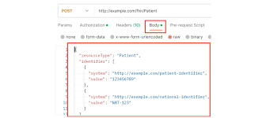

# Despliegue y Evidencias

En esta sección se detalla cómo levantar el entorno y las pruebas de funcionamiento (Parte 5 y 6 del parcial).

## Ejecutar el Proyecto con Docker

A continuación, se muestran los comandos necesarios para construir y ejecutar el contenedor de la aplicación

=== "Docker CLI"

    ```bash
    # Construir la imagen
    docker build -t ParcialFinalN-Capas .
    
    # Ejecutar el contenedor
    docker run -p 8080:8080 ParcialFinalN-Capas
    ```

=== "Docker Compose"

    ```bash
    # Levantar la app y la base de datos PostgreSQL
    docker-compose up -d
    ```

## Evidencia de Funcionamiento

A continuación, se muestra una captura comprobando que los flujos de seguridad y los roles se comportan correctamente utilizando nuestra colección de Postman:


