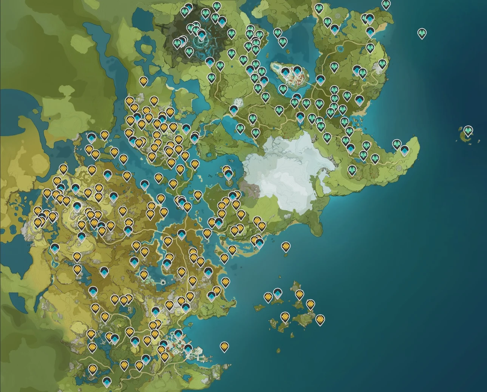

# Recursos y Farmeo

Para automatizar la recolección, aquí tienes unos scripts útiles.

=== "Python"

    ```python
    def recolectar_recurso():
        print("Recolectando flor...")
    ```

=== "JavaScript"

    ```javascript
    function recolectarRecurso() {
        console.log("Recolectando flor...");
    }
    ```

### Mapa de rutas
Aquí tienes una imagen de referencia para la ruta de farmeo:

